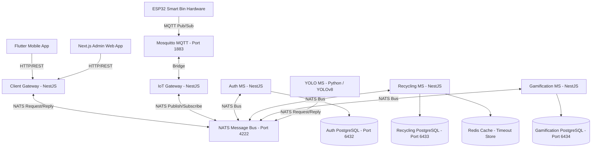
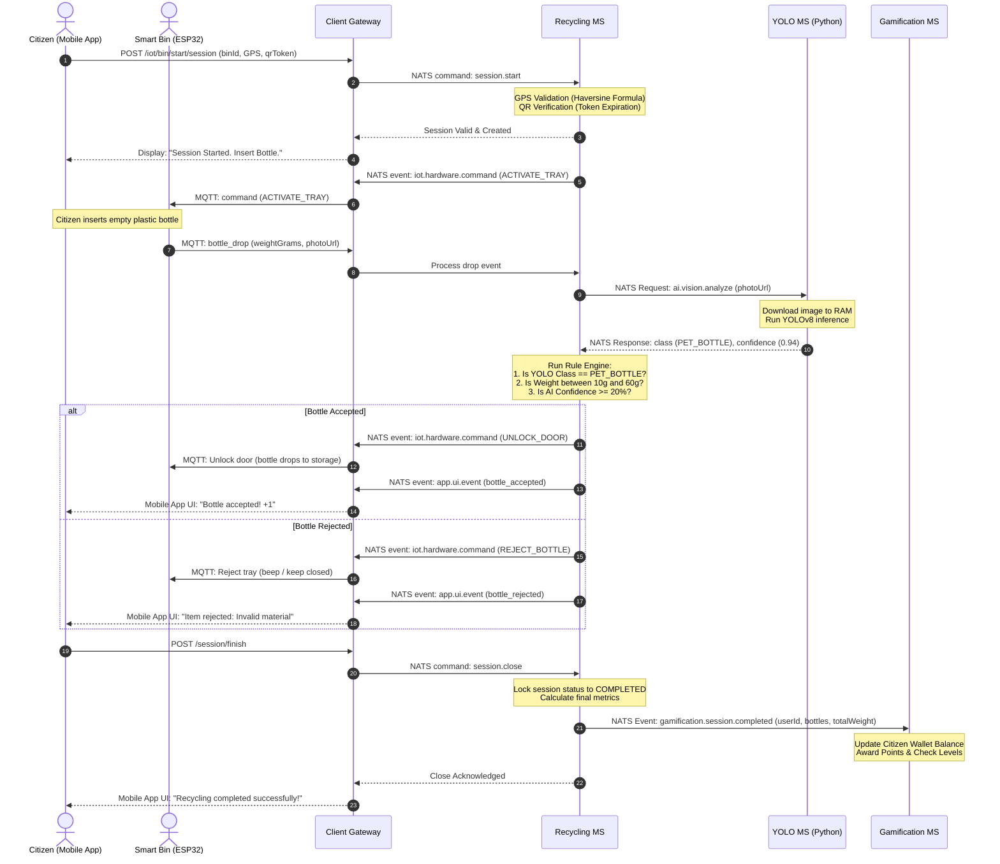

# RecySmart OS Backend - Microservices Architecture Review

I have reviewed the backend codebase located in [ms-launcher](file:///C:/Users/JOHAN/Documents/JP/RecySmart/ms-launcher). Below is a comprehensive breakdown of the system architecture, event flows, and domain models.

---

## 1. System Topology Overview

RecySmart OS uses an **Event-Driven Microservices Architecture** built with NestJS, Python, PostgreSQL, Redis, NATS, and MQTT.

---

## 2. End-to-End Recycling Session Lifecycle

The following diagram illustrates how the components coordinate dynamically when a citizen interacts with a Smart Bin:

---

## 3. Microservice Architecture Breakdown

### 🔑 Authentication Service (`auth-ms`)
* **Framework**: NestJS & Prisma
* **Database**: PostgreSQL (Port `6432`)
* **Domain Model**:
  * `User`: Stores credentials, status, and role-based permissions (`ADMIN`, `RECYCLER`, `ALLY`).
* **Role Definitions**:
  * `ADMIN`: Accesses the web dashboard (`recysmart-admin-web`) to monitor IoT networks, view global KPIs, and configure settings.
  * `RECYCLER`: Citizen user who scans QR codes on bins, tracks ecological statistics, and redeems coupons via the mobile app.
  * `ALLY`: Partner companies (brands) who list rewards/coupons and redeem them at checkout.

### ♻️ Recycling Service (`recycling-ms`)
* **Framework**: NestJS & Prisma
* **Database**: PostgreSQL (Port `6433`) & Redis (Timeout Management)
* **Domain Models**:
  * `SmartBin`: Represents physical IoT bins. Stores GPS coordinates (`latitude`/`longitude`), `status` (`IDLE`, `ACTIVE`, `FULL`, `MAINTENANCE`), `apiKey` (ESP32 authorization), and dynamic `qrToken` (rotating code to prevent photo-based scanning fraud).
  * `Session`: Manages active user sessions at bins. Stores active user references, count of accepted bottles, and elapsed time.
  * `BottleDrop`: Logs each bottle insert attempt. Stores weight, image URL, AI confidence score, and status (`ACCEPTED`, `REJECTED_WEIGHT`, `REJECTED_AI`).

### 🏆 Gamification Service (`gamification-ms`)
* **Framework**: NestJS & Prisma
* **Database**: PostgreSQL (Port `6434`)
* **Domain Models**:
  * `Wallet`: Holds user point balances (`currentBalance`, `lifetimeEarned`) and aggregate statistics (total weight recycled).
  * `Level`: Threshold configurations for levelling up (e.g., "Eco Beginner" to "Recycle Master").
  * `PointTransaction`: Idempotent log of points earned (from recycling sessions) or spent (redeeming coupons).
  * `PartnerCompany`: Profile data of allied brands (supermarkets, retail shops) who fund and publish rewards.
  * `Reward` / `UserCoupon`: Reward details (points cost, stock availability) and coupons generated for users, including security QR codes for store redemptions.

### 🧠 AI Vision Service (`yolo-ms`)
* **Framework**: Python, OpenCV, `ultralytics` (YOLOv8), and `nats-py`
* **Inference Model**: Pre-trained YOLOv8 nano model (`yolov8n.pt`).
* **Optimized Pipeline**:
  * Subscribes to the NATS channel `ai.vision.analyze`.
  * Downloads images directly into RAM buffers using `aiohttp` and OpenCV (`imdecode`) to bypass disk write latencies.
  * Checks if object detection locates a `"bottle"`, outputs a confidence score, and replies instantly back to the NestJS rule engine over NATS.

---

## 4. Key Engineering & Security Highlights

1. **Anti-Spoofing GPS Engine**:
   To prevent users from trying to start a session from home using fake GPS coordinates, `recycling-ms` calculates physical distance using the **Haversine formula** comparing the citizen's mobile GPS data with the bin's static coordinates. The transaction is rejected if they are further than **10 meters** away.
2. **Rotating QR Codes**:
   To prevent citizens from printing or taking a photo of a bin's QR code and scanning it repeatedly from elsewhere, the Smart Bin displays a rotating QR code backed by a dynamic `qrToken` in the database that has short-lived expirations.
3. **Idempotent Transactions**:
   Points are credited to user wallets only when NATS processes the `'gamification.session.completed'` event. Each point transaction tracks a `reference` (the unique `sessionId`) to enforce absolute database idempotency, preventing double-credits.
